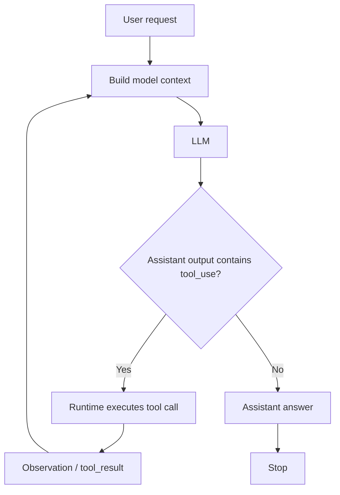
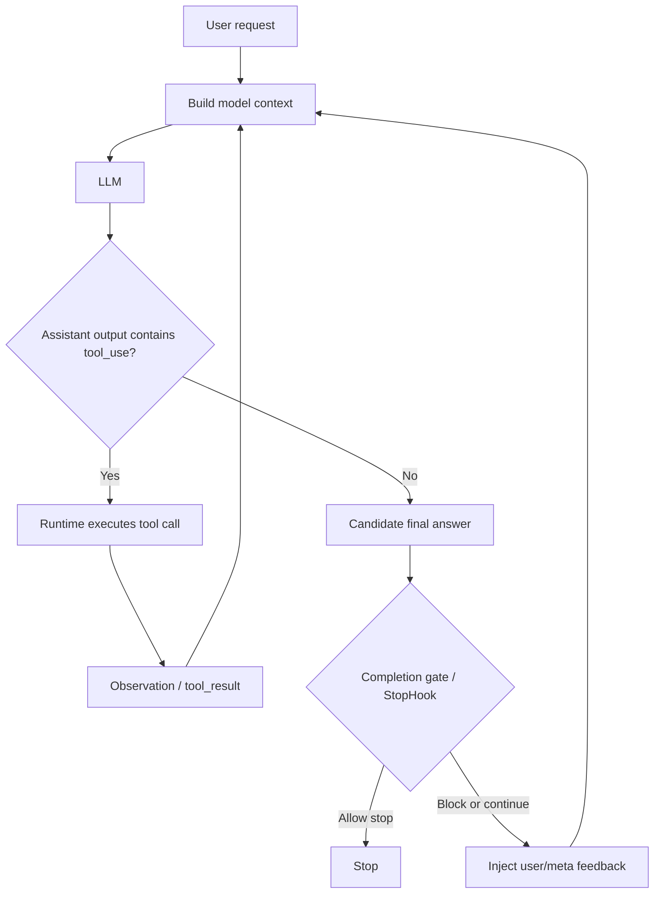
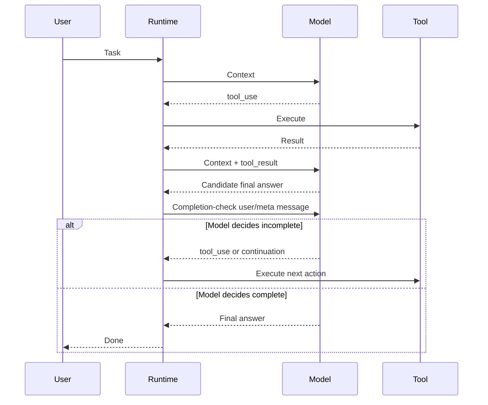

# Minimal Agent Loop

Last Updated: 2026-05-21

## Purpose

This note captures the smallest useful mental model for an LLM agent. It is not
a full architecture taxonomy. The goal is to separate the core loop from the
extra runtime mechanisms that make a production agent more reliable.

## Core Idea

The minimal agent is a loop around one decision:

- if the model calls a tool, the runtime executes the tool and feeds the result
  back into context;
- if the model does not call a tool, the runtime treats the turn as a candidate
  final answer and stops.



The important point is that "stop" is not a special model action. In the
smallest loop, stopping is the absence of another tool call.

## Message-Level Shape

At the message protocol level, the loop usually looks like this:

```text
user:      task
assistant: answer or tool_use
user:      tool_result / observation
assistant: answer or next tool_use
```

The second `user` message does not necessarily come from a human. It is the
runtime's observation channel. Tool results, background task notifications,
hook feedback, and injected reminders can all enter through user-role or
system/runtime channels depending on the product.

## With Completion Gates

Production agents often add gates around the apparent stop point. The model may
think it is done, but the runtime can still ask whether the result satisfies a
larger objective or whether a configured hook wants to continue.



This is still the same core loop. The gate does not replace the agent loop; it
adds a programmatic interception point after the model proposes completion.

## Long-Horizon Goal Injection

Some systems add a broader objective outside the immediate user turn. For
example, after the model produces a candidate final answer, the runtime can
inject a user/meta message such as:

```text
Check whether the long-term objective is complete.
If it is incomplete, continue by calling tools or explaining the next step.
```

That creates a second chance for the model to decide whether to continue:



The tradeoff is clear:

| Mechanism | Benefit | Cost |
| --- | --- | --- |
| Plain no-tool stop | Lowest token cost and simplest behavior | Can stop too early |
| StopHook / completion gate | Programmatic safety and policy control | Extra runtime complexity |
| Long-horizon goal injection | Gives the model a chance to continue toward a larger objective | Extra model call and possible over-continuation |

## Practical Interpretation

The minimal agent loop is surprisingly small:

```text
context -> model -> answer | tool_use
tool_use -> runtime -> observation -> context -> model
answer -> stop gate -> done | injected feedback -> context -> model
```

Most engineering complexity sits outside the loop:

- what context is injected before the model call;
- which tools are exposed;
- how tool results are compressed, formatted, or persisted;
- whether apparent completion is accepted immediately;
- whether longer-term objectives can re-enter the context as user/meta feedback.

This is why a production agent can look sophisticated while still having a very
simple core: the core loop is small, and the surrounding runtime decides what
the model sees, what it may do, and when it is allowed to stop.
